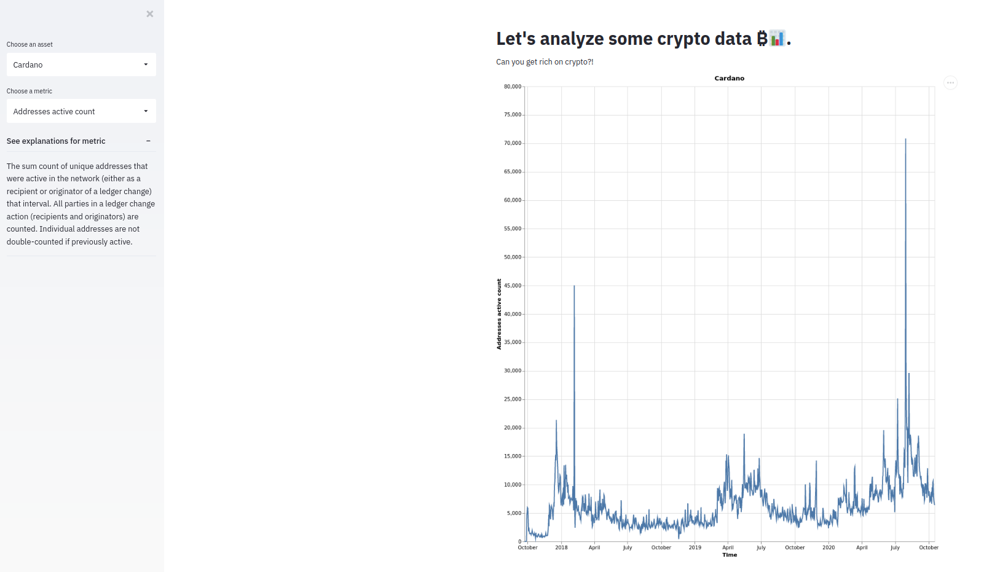

# Veg-et-a Lite

TODO CHANGE ME


Let's go super saiyan on Crypto currency. Our graphs allow you to interactively analyze the most up to date information on the most popular cryptocurrencies on the market.


## Project Goals

TODO: **A clear description of the goals of your project.** Describe the question that you are enabling a user to answer. The question should be compelling and the solution should be focused on helping users achieve their goals. 

Objective
Provide a visualization tool that enables end users interested in trading cryptocurrency to make informed unbiased decisions. Our team aims to provide an easy to navigate application that visually illustrates critical data points necessary for customers to formulate their own forecasting analysis.

Introduction

Background
Cryptocurrency - The popularity of cryptocurrency has increased since its introduction in 2009. The rapid growth of cryptocurrency is attributed to the foundational characteristics that surround decentralized currency. The same features that have attracted many investors have also contributed to the high degree of volatility index. The associated risk and overwhelming introduction of other cryptocurrencies has forced novice investors to be reluctant in investing. 

---Quick description in rapid growth of customer use of brokerage apps like robinhood since the pandemic----
Brokerage apps - 

---Quick overview of cryptocurrency performance overtime and since the pandemic 
Performance - 

Project Group Goals
---The need to provide quick, rational, dynamic interactive illustrations to aid in the decision making process for investing in cryptocurrency. And the questions the group hopes to answer with the illustrations. AKA get rich quick scheme. 

## Design
Some of these design decisions are covered in the development section but we wanted to highlight some important ones here

Critical data points that drive successful investment decisions that our illustration captures

### Realtime Data
Our customers expect the very best from us; our product wouldn't be very useful to them if we didn't show them the most up to date metrics available. It was for this reason that we chose to not use static csv files as our data source, but instead integrate with a web API to be able to continuously pull and display the most up date, realtime metrics available. 

REMOVE THIS WHEN WE'RE DONE
TODO: **A rationale for your design decisions.** How did you choose your particular visual encodings and interaction techniques? What alternatives did you consider and how did you arrive at your ultimate choices?

## Development

### Getting the Data
The team was originally comprised of just Joe and Josh. We thought that analyzing some cryptocurrency metrics would be interesting and provide us with a good amount of data. We found this site [Coin Metrics](https://coinmetrics.io/community-network-data/) which provided fairly clean and robust data on a bunch of different coins. We were originally going to use static csv files for uploading data and converting to data frames, but this introduced a significant issue. What use are our charts if they only show data up to some arbitrary date in which we decided to download the CSV. This is when we discovered that Coin Metrics also exposes a free [Web API](https://docs.coinmetrics.io/api/v2/). If we could connect to the web API then we wouldn't have stale data, and can continuously show the most up to date metrics. The other cool thing is that as Coin Metrics adds or removes different types of metrics, we can dynamically add and remove these metrics from our charts. 

Joe, who has previous experience in web development, got to work on [coin_metrics.py](coin_metrics.py) which exposes a bunch of python methods for communicating with the web API. It took roughly 2 hours to complete. The most tricky thing was that in order to convert the data into a dataframe we needed it in a specific format for pandas to accept it, specifically something like this
```
{
  "column1": [<column1-values>],
  "column2": [<column2-values>],
  ...
}
```
Our data looked like this
```
[
  {
    "col1": <row1-col1-value>,
    "col2": <row1-col2-value>,
    ...
  },
  {
    "col1": <row2-col1-value>,
    "col2": <row2-col2-value>,
    ...
  },
  ...
]
```
After some preprocessing of our data though we were able to easily convert it to a dataframe.

### The Main Chart
For the main chart we wanted to allow people to see any metric for any crypto asset. We decided to plot the metric on the y axis and time on the x. Our goal was to make it look like any other stock chart you'd see if you googled "Stock X prices", but we'd show crypto currency coins and we'd allow you to see any metric. After roughly 3-5 hours of pair programming, Joe and Josh created a chart that worked in the following way:
1. The user would see a drop down menu of all available crypto coins that they could select from. This would default to the first coin returned by the API.
2. The user would then see a drop down menu of all available metrics for that coin that they could select from. This would default to the first metric returned by the API.
3. The user would then see that metric plotted 
Since some of the metrics are not immediately obvious, Joe added a little blurb to explain to currently selected metric. This took roughly 45 minutes. 
It originally looked like this


### Addition of Jeffrey
At this point we heard Jeffrey still hadn't found a group, so we added him to ours to become a group of 3.


REMOVE THIS ONCE WE'RE DONE
TODO: **An overview of your development process.** Describe how the work was split among the team members. Include a commentary on the development process, including answers to the following questions: Roughly how much time did you spend developing your application (in people-hours)? What aspects took the most time?
